# Prerequisites

This guide will go over everything you need to follow along the workshop.

# Required Hardware

- Raspberry Pi 3 or 4
- Raspberry Pi power supply
- Micro SD with 8GB or more
- Micro SD card reader
- Personal Computer
- Smartphone (optional if your computer connects WiFi)

# Required Software

- [Etcher.io](https://www.balena.io/etcher/): Easily flashes our Mozilla IoT gateway image.
- A modern web browser: Loads the WebThings Gateway website on your Pi.

# 1. Flash Your Micro SD Card

Before plugging in your Raspberry Pi, you'll need to flash its Micro SD Card. 

**Download our custom [Mozilla IoT Gateway image](https://drive.google.com/file/d/1ZKqFcJUALA2BUYMNBbGhT_n-O27zKFDj/view?usp=sharing) and open Etcher to begin flashing.**

<details>
<summary>
What's inside our image?
</summary>

Aside from the following dependencies, our image is a slimmed down Mozilla IoT Gateway image based on Raspbian Buster. These dependencies are listed here, if you wish to replicate this in another setup.
- [MATRIX Lite JavaScript Setup](https://matrix-io.github.io/matrix-documentation/matrix-lite/getting-started/javascript/)
- [MATRIX Kernel Modules](https://matrix-io.github.io/matrix-documentation/matrix-creator/resources/microphone/#usage)
- [MATRIX Creator Addon](https://github.com/matrix-io/matrix-mozilla-iot-addon)
- [Voco Addon](https://github.com/createcandle/voco) with some minor edits to recognize MATRIX microphones
</details> 

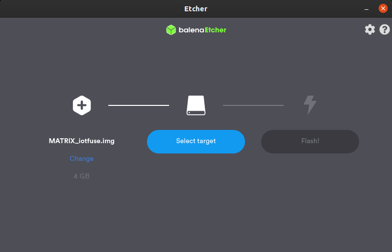

# 2. Connect The Raspberry Pi To Your Network

Once flashed, reinsert the Micro SD Card into your computer. A volume named `boot` should appear. This step will have you add your WiFi configuration into this volume.

>**Your Pi must be on the same network as your personal computer.**

>**This step can be skipped if your Raspberry Pi has an ethernet connection.**

Create an empty file on your computer named `wpa_supplicant.conf` and add following information inside:
```
country=YOUR_COUNTRY
ctrl_interface=DIR=/var/run/wpa_supplicant GROUP=netdev
update_config=1

network={
    ssid="YOU_WIFI_NAME_HERE"
    psk="YOUR_WIFI_PASSWORD_HERE"
}
```

Be sure to change *YOUR_COUNTRY*, *YOUR_WIFI_NAME_HERE*, and *YOUR_WIFI_PASSWORD_HERE*.

After you verify that your information is correct, drag & drop the file into the `boot` volume. You can now eject and insert the Micro SD Card into your Raspberry Pi. The MATRIX Creator should be attached as well.

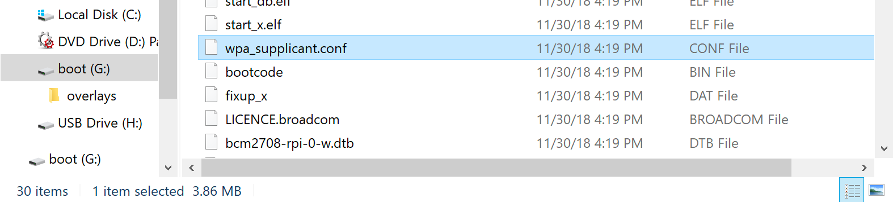

# 3. Register An Account For Your Gateway
Open a web browser on your PC and type in gateway.local.

If that does not work, type in the IP address of your Raspberry Pi instead.

If you're not sure how to find your Pi's IP, you can download one of the following network scanners to your smartphone.

<div align="center">
<a href="https://itunes.apple.com/us/app/inet-network-scanner/id340793353?mt=8"></a>
<a href="https://play.google.com/store/apps/details?id=com.overlook.android.fing&hl=en"></a>
</div>


Once you have accessed the Gateway through your browser, the following page should appear.

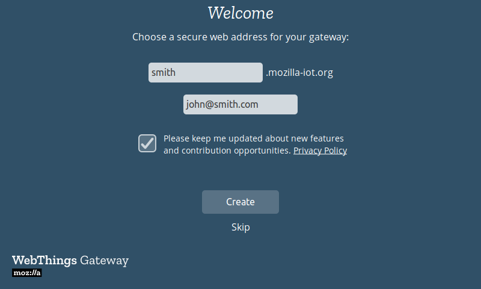

You can either *Create* a subdomain, provided by Mozilla, or choose to *Skip* this step.

Then, create your first user account on the gateway. Enter your name, email address and a password then click “Next”.

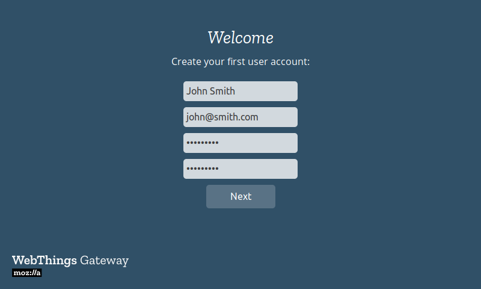

You should then be redirected to an empty “Things” screen of the gateway where you can start to add devices.

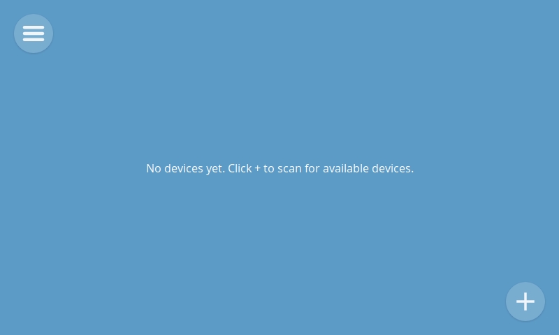

# 4. Enable SSH and Set Time Zone
One of our workshop activities will make use of time. In order for this to work properly, you will need to configure your Raspberry Pi to the appropriate time zone.

On the Gateway interface in your browser, navigate to the sidebar. Click on **Settings** -> **Developer**.

Check the box next to **Enable SSH**.

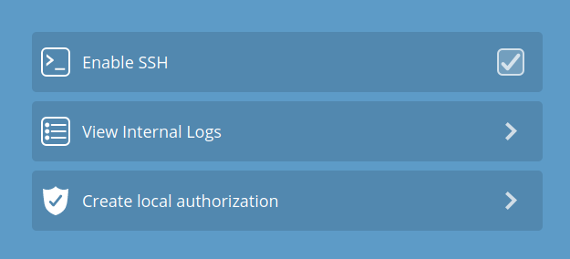

Then open an SSH enabled terminal application on your computer:

- Windows 10: PowerShell
- macOS/Linux: Terminal
- Windows 7 & 8: [Download Putty](https://www.putty.org/)

Enter the following command to SSH into your Pi:
```
ssh pi@YOUR.PI.IP.HERE
```
```
#example
ssh pi@192.168.1.129
```
When prompted for a password, type raspberry followed by the enter key. Your terminal screen should be similar to the image below.

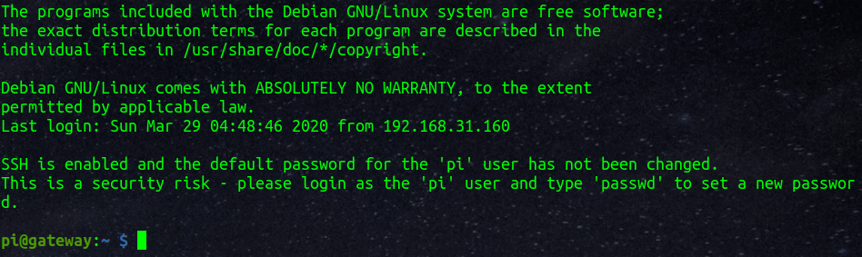

In your terminal,

- Run the command " sudo raspi-config" and press enter. The menu below should appear.
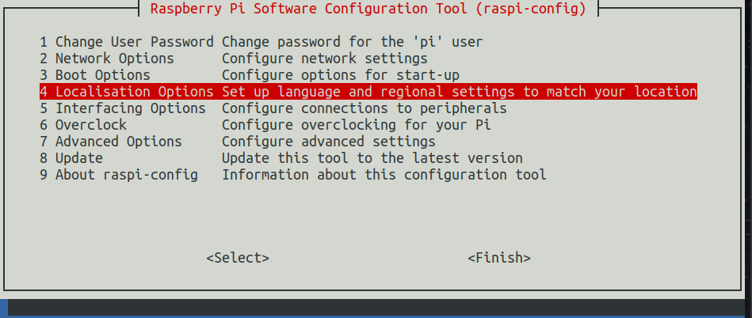

- Select "Localisation Options"
- Select "Change Timezone"
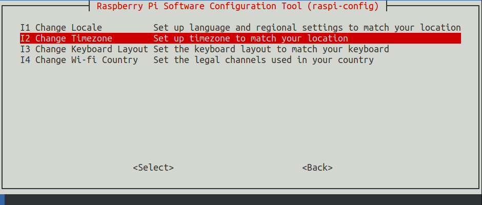

- Select your Geographical Area
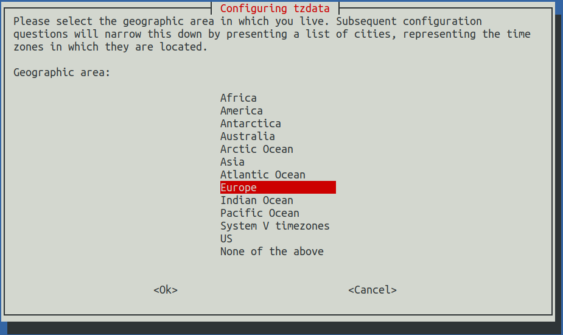

- Select your Homecity, nearest city listed there, or time zone name
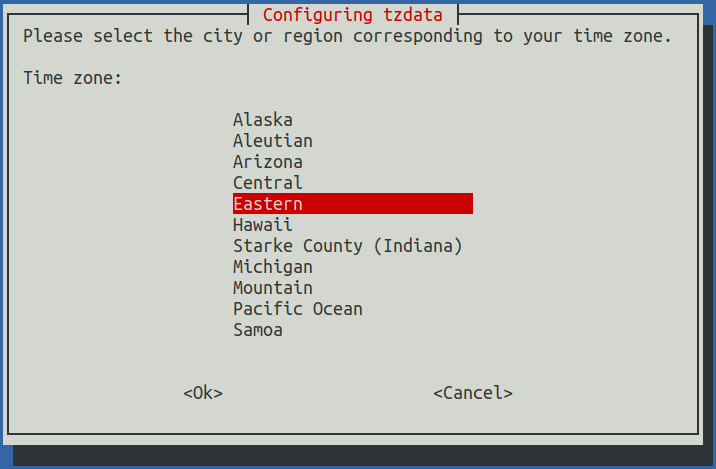

- Select Finish
- Reboot your Pi by typing the following in your terminal
```
sudo reboot
```


# 5. Follow The Workshop

You're now all set to follow along with our [workshop](./Workshop.md)!
