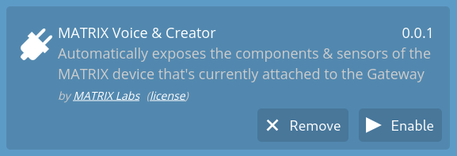
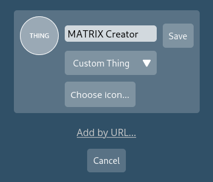
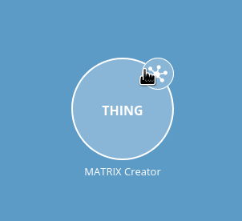
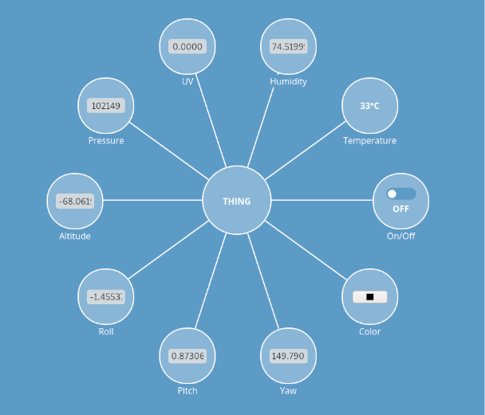

# Overview

This workshop will go over how you can easily employ a privacy-focused voice assistant with MATRIX devices, an IoT development platform powered by Arm microcontrollers and Xilinx FPGAs, on the Mozilla IoT WebThings Gateway to quickly deploy an effective voice-enabled product for your home or company.

The workshop will walk through how to use the Mozilla IoT Gateway through its UI as well as with voice commands to read MATRIX device sensors, control LEDs, GPIOs, and more. Participants can then create custom rules with these tools to set up their assistant to suit their needs, from personal home automation, to warehouse item provisioning, or retail voice assistance.

We will show you how to:

- Control the LEDs manually from the Things UI
- Enable the voice assistant (one you can use from a website)
- Trigger LEDs from voice assistant
- Add rule based on UV value to trigger notification & LED color change

# 1. Enabling The MATRIX Addon

The image provided for this workshop contains the Mozilla IoT gateway preinstalled with our MATRIX addon. Once logged into your Gateway, go to **settings** -> **Add-ons** and then click **Enable** on the MATRIX addon.

With the addon enabled, you can now add the MATRIX Creator as a Thing. Go into your **Things** menu and select the **+** icon. Click **Save** and then **Done** on the Creator.

# 2. Interacting With The MATRIX Creator

Each Thing we add will have a menu we can access to control or view various properties Click on the Creator's node-like icon to access its menu.

The menu will contain a live view of the Creator's sensor data and and option to control the LEDs.

Feel free to edit the **Color** property and then toggle the **On/Off** switch! The LEDs will change to the colors that you set.

# 3. Creating Custom Rules

Custom rules on the MozillaIoT Gateway provide a great drag-and-drop interface for conditional closed-loop control in your project.

To create a custom rule for your project, navigate to "Rules" on the sidebar.

Click the plus icon in the lower right corner to create a new rule.

In rule creation, the basic logic is: if (A), then (B). Optionally, you can change “if” to “while” and combine multiple inputs for (A), and take action against multiple outputs for (B).

In this workshop, we will be exploring rule creation through to simple functions.
- *Rule 1*: **If** it is a certain time, **then** change MATRIX Creator LEDs color to blue **and** turn MATRIX Creator LEDs on.
- *Rule 2*:  **If** pitch > 30, **then** change MATRIX Creator LEDs color to purple **and** turn MATRIX Creator LEDs on **and** send a browser notification.

### Rule 1
***If** it is a certain time, **then** change MATRIX Creator LEDs color to blue **and** turn MATRIX Creator LEDs on.*

Drag the clock device into the left side of the page and two instances of the MATRIX Creator device to the right side.

When dragging devices, you'll see the left side is inputs and the right side is outputs.

Name your rule on the top left corner of your screen. I've named it "Lights on at Dusk".

At this point, you should see part of the if-statement filled out as shown below.

Adjust the time in the clock device input to be 5 minutes from the present time. 

If you fulfilled the pre-requisites, your Raspberry Pi should already be configued to your time zone. If it is not, please follow the directions here first.

Select the "Color" property in the dropdown for the top MATRIX Creator device and set the color to blue.

Select the "On" property for the bottom MATRIX Creator device.

Your rule should now be complete and look something like this.

It should trigger in just a few minutes!

Go back to the "Rules" page and select the plus sign on the bottom right corner once again to create *Rule 2*.

### Rule 2
***If** pitch > 30 degrees, **then** change MATRIX Creator LEDs color to purple **and** turn MATRIX Creator LEDs on **and** send a browser notification.*

Drag a MATRIX Creator device to the left as an input, two instances of MATRIX Creator to the right as output, along with a "Browser Notification" button for output.

Name your rule on the top left corner of your screen. I've named it "Pitch Change".

Select the property "Pitch" for the input device. Use the dropdown to change the "<" sign to ">", and change the number to 30.

On the output side, select the "Color" property in the dropdown for the top MATRIX Creator device and set the color to green.

Select the "On" property for the bottom MATRIX Creator device.

In the browser notification output, type "Pitch over 30" in the *Message* field.

Your rule should now look something like this.

Select the dropdown by **If** in the top left and change it to **While**. This way the reaction occurs only when the pitch is over 30, otherwise the system will revert to its previous state.

Go back to the "Things" page and test your rule by moving your MATRIX Creator until the "Pitch" value goes above 30 degrees and move it until "Pitch" is once again below 30 to see its state change back.

# 4. (TODO) Enabling The Web Voice Assistant
